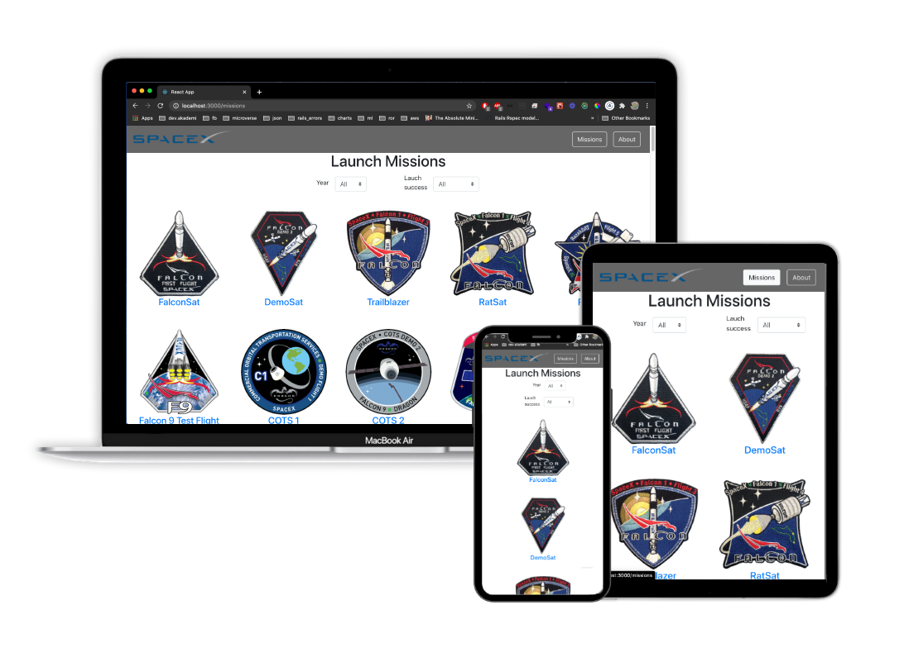

# Catalogue of Statistics: SpaceX Launch Missions

It is a single-page application to present space exploration missions are done by SpaceX company. [SpaceX Data API](https://docs.spacexdata.com/#intro) is used to get the data. 

## Screenshot




## Live demo

- [Live demo in Heroku](https://spacex-react-redux.herokuapp.com)

## Video presentation

  - https://www.loom.com/share/295838881c314ce4981503283514a5ae

  - https://www.loom.com/share/228f1dc9eb9b44dba40c2c4c6854810e


## Milestones of the project.

### Day 1

**Milestone 1 - project setup**

Select the API you are going to use. Build files structure for your React app. Prepare routes and navigation in your app.

**Milestone 2 - index page with filters**

Make sure that a user can display a list of items and filter them. Data should come from the backend API.

### Day 2

**Milestone 1 - single item page**

Make sure that a user can display a details page for each item. Data should come from the backend API.

**Milestone 2 - styling & testing**

If you need some extra time for adding tests or making your app more beautiful. Now it's the time for this! Also, you can fix any minor bugs that you could have found in your app.

### Day 3

**Milestone 1 - connect to API and receive data**

Work on nice-to have features(s)

**Milestone 2 - deploy & video**

Check if the deployed version of the app is working perfectly. Record your video. You are ready for a code review!

## Build with the following guidelines: 

- Use JSX syntax correctly
- Pass info to components using props with validation
- Use React components lifecycle methods
- Use DOM event listeners in components
- Use lifting to pass state from children to parent components
- Use client-side routes
- Design the components structure for a website
- Test React code
- Use Redux store to keep state
- Connects Redux to React app (includes map state and dispatch to props)
- Deploy apps (Heroku, Netlify)
- Use linters (code standards)
- Maintain professional Github Repos

## Built with the following tech stack

- [Node.js](www.nodejs.org)
- [npm](https://www.npmjs.com/)
- [ES6](http://es6-features.org/) 
- [React](https://reactjs.org/)
- [React-DOM](https://reactjs.org/docs/react-dom.html)
- [create-react-app](https://github.com/facebook/create-react-app)
- [React-Redux](https://github.com/reduxjs/react-redux)
- [Redux](https://github.com/reduxjs/redux)
- [PropTypes](https://www.npmjs.com/package/prop-types)
- webpack (create-react-app uses it, didn't set it manually)
- Heroku
- [Jest](https://jestjs.io/)
- ESLint
  - eslint-config-airbnb
  - eslint-plugin-jsx-a11y
  - eslint-plugin-react
  - eslint-plugin-react-hooks
- Stylelint
  - stylelint-config-standard
  - stylelint-csstree-validator
- Pure CSS
- [react-bootstrap](https://react-bootstrap.netlify.app/)


### Setup

Clone the repo by typing

```
git clone https://github.com/RaminMammadzada/react-redux-SpaceX.git
```

Install packages with

```
  npm install
```

Start server with:

```
  npm start
```
Runs the app in the development mode.\
Open [http://localhost:3000](http://localhost:3000) to view it in the browser.


### Unit tests

Clone the repo by typing

```
npm run test

```

## Author

👤 **Ramin Mammadzada**

- Github: [@raminmammadzada](https://github.com/raminmammadzada)
- Twitter: [@raminmammadzada](https://twitter.com/raminmammadzada)
- Linkedin: [Ramin Mammadzada](https://www.linkedin.com/in/raminmammadzada/)

### Contributing

Contributions, issues, and feature requests are welcome!

Feel free to check the [issues page](https://github.com/RaminMammadzada/react-redux-SpaceX/issues)

### Show your support

Give a star if you like this project!


